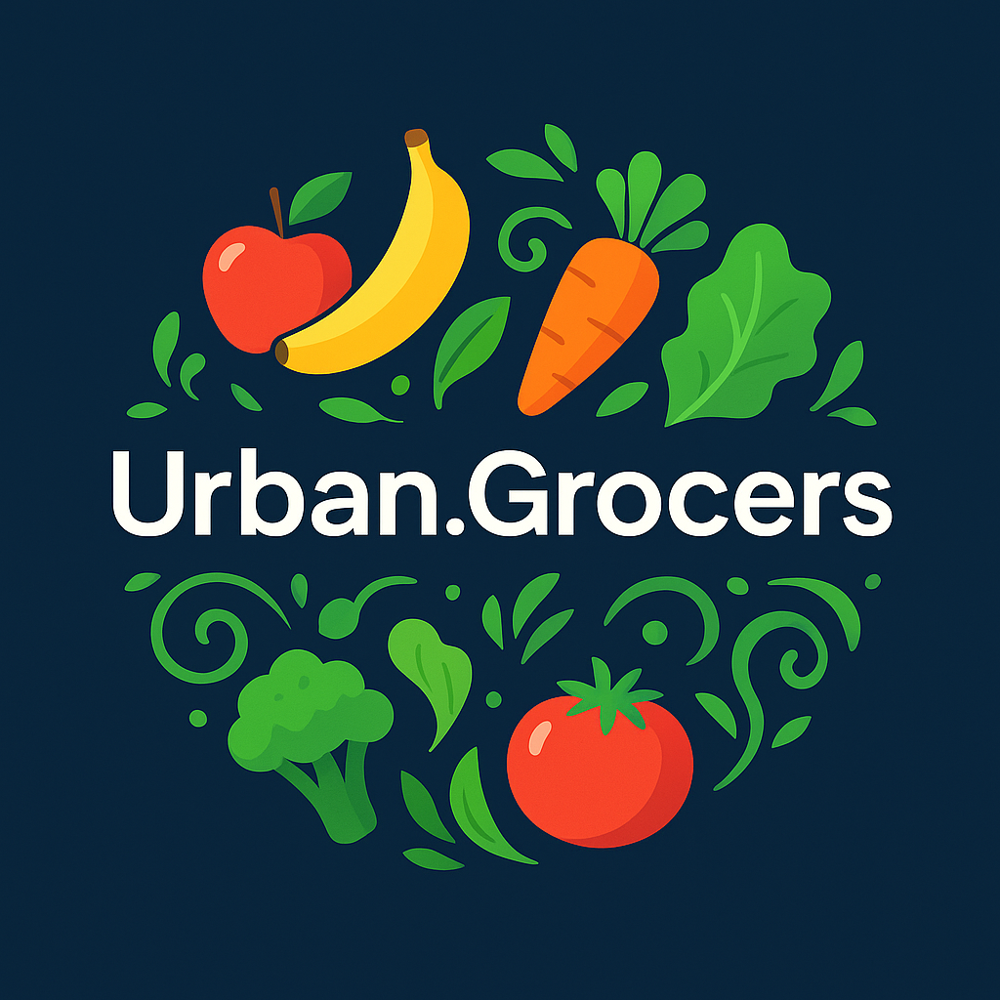
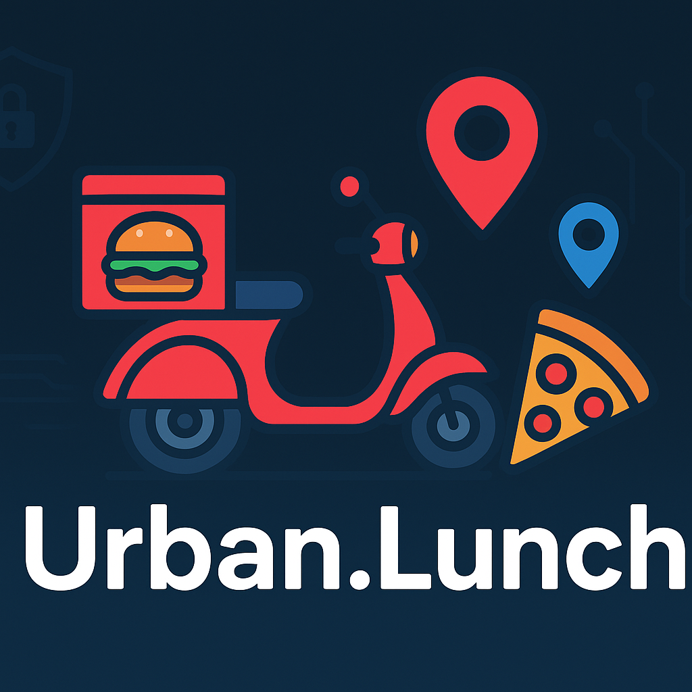

<h1 align="center"><b>Hello World, I'm Camilo Morales </b></h1>

<!-- Followers Count and Views Count -->

---

<!--About Me-->

<picture></picture> About me

I’m a professional with a background in Finance, Logistics, and Customer Service, now transitioning into Software Quality Assurance (QA) and IT. My journey has given me strong analytical, organizational, and people skills, which I now combine with technical expertise in manual and automated testing.

I work with tools like Selenium, Postman, JIRA, SQL, and I’m building automation skills in Python. Beyond QA, I’m also exploring Cybersecurity fundamentals to strengthen my technical foundation.

🌱 Currently 

- 🎓 Completing the **QA Engineering bootcamp at TripleTen**  
- 🧪 Gaining hands-on experience testing **mobile apps, web apps, and APIs**  
- 🔧 Learning **Python, SQL, and automation tools**  
- 🌐 Exploring **Cybersecurity fundamentals** to strengthen my technical foundation  
- 💡 Known for **curiosity and adaptability** — always eager to learn, improve, and share knowledge

## My Skills Include

<h4> Languages </h4>
 
  
  

   

<h4> QA Tools </h4>

   
  
  
  

  

<h4> Documentation </h4>

  
  
  
  
  

  

<h4> Other Tools and Technologies </h4>

  
  
  
  
  
  

## Featured Projects
<table>
<tr>
<td width="50%">
<h3 align="center">Urban Grocers (API Testing)</h3>

<a href="https://github.com/Jcma14/Urban-Grocers-API-Testing-" target="_blank">

Performed API and Backend testing for an online grocery service. Focused on validating new back-end functionality against documented requirements.

                                                                                      
</td>

<td width="50%">
<h3 align="center">Urban Lunch (Mobile App) Testing</h3>

                                       

 

<a href="https://github.com/Jcma14/Urban-Lunch-Mobile-App-Testing" target="_blank">

Performed Mobile Testing for a food ordering app using Android Studio. Tested ordering flows, geolocation permissions, and error message validation.

                                                             
</table>                                                                                 

 

## What Sets Me Apart

✨ **Curiosity:** I dive deep into understanding how things work, whether it’s an app, a network, or a testing framework.  
✨ **Continuous Growth:** I stay updated with the latest QA and IT trends to adapt quickly in a fast-changing tech world.  
✨ **Transferable Skills:** My background in finance has sharpened my analytical thinking, attention to detail, and client-focused approach.  

## Let’s Connect

## ⚙️ &nbsp;Analytics

### **Thanks for visiting my GitHub — follow along as I grow my portfolio and keep pushing my skills forward!**

<!--
**Jcma14/Jcma14** is a ✨ _special_ ✨ repository because its `README.md` (this file) appears on your GitHub profile.

Here are some ideas to get you started:

- 🔭 I’m currently working on ...
- 🌱 I’m currently learning ...
- 👯 I’m looking to collaborate on ...
- 🤔 I’m looking for help with ...
- 💬 Ask me about ...
- 📫 How to reach me: ...
- 😄 Pronouns: ...
- ⚡ Fun fact: ...
-->
