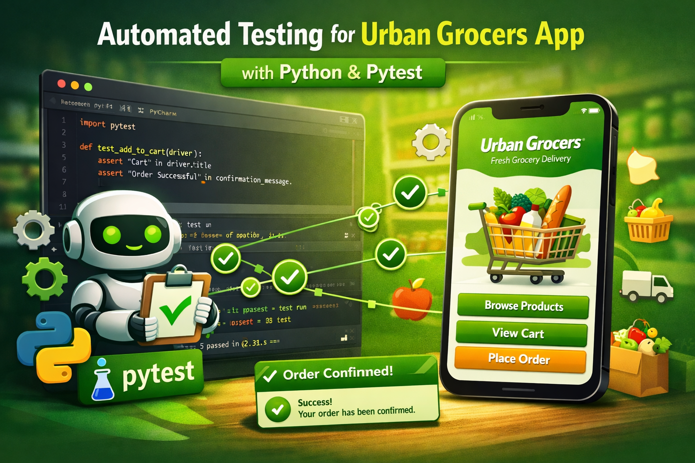
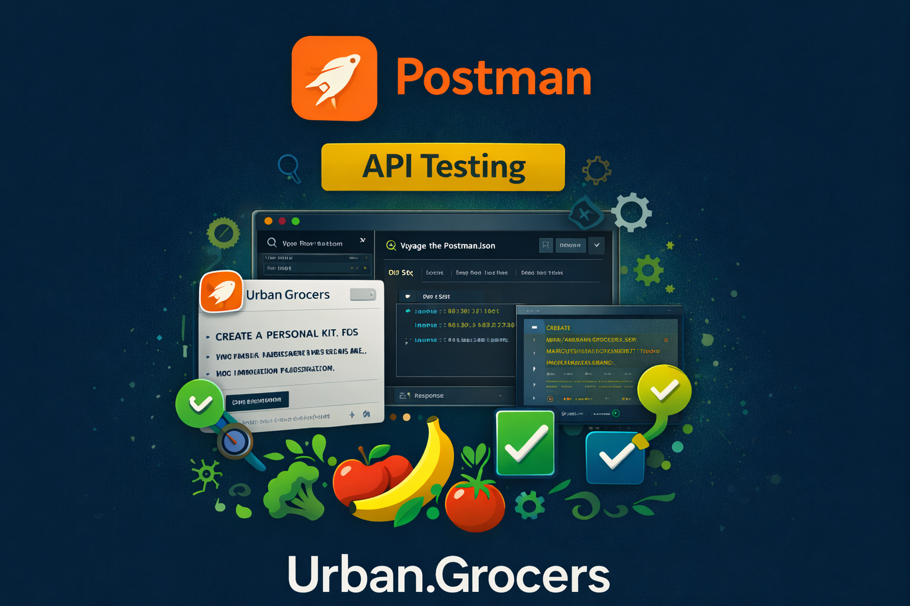
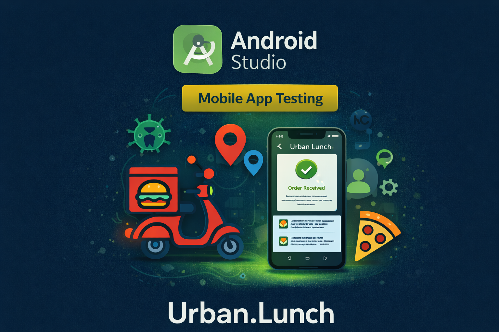

<h1 align="center">Hi, I'm Camilo Morales&nbsp;</h1>

  <b>QA Engineer → Security Engineer in the making</b> 
  Perth, Australia&nbsp

  
  
  

-----

## About Me

I’m a QA Engineer transitioning into **Cybersecurity**, with a background spanning Finance, Logistics, and Customer Service. I finished my QA Engineering bootcamp at TripleTen and I’m now deepening my technical foundation through hands-on cybersecurity labs, a home lab setup, and self-directed study.

In **Semester 2, 2026**, I’ll begin a **Master of Cyber Security at Edith Cowan University (ECU)** in Perth, one of Australia’s leading institutions in the field, with a scholarship and an industry placement program in the final semester.

My goal is to work as a **Security Engineer or Analyst**, combining my QA mindset (systematic thinking, structured testing, documentation) with security fundamentals.

-----

## 🎯 Currently

- 🎓 Accepted into the **Master of Cyber Security at ECU** — starting Semester 2, 2026
- 🛡️ Building a **cybersecurity home lab**: Kali Linux VM, SSH, network segmentation, Raspberry Pi phase coming
- 🔬 Working through **KC7** (KQL threat hunting) and **CyLab/picoCTF** challenges
- 📓 Maintaining an **Obsidian Cyber Vault** for structured notes and an evolving learning methodology
- 📂 Logging everything publicly in my **[Learning Log](https://github.com/Jcma14/My-learning-log)**
- ✅ Graduated from the **QA Engineering Bootcamp at TripleTen**

-----

## 🛠️ Skills & Tools

<table align="center">
<tr>
  <td align="center" width="96">
    
     Python
  </td>
  <td align="center" width="96">
    
     Git
  </td>
  <td align="center" width="96">
    
     GitHub
  </td>
  <td align="center" width="96">
    
     VS Code
  </td>
  <td align="center" width="96">
    
     Figma
  </td>
  <td align="center" width="96">
    
     Obsidian
  </td>
  <td align="center" width="96">
    
     Selenium
  </td>
  <td align="center" width="96">
    
     Postman
  </td>
  <td align="center" width="96">
    
     Android Studio
  </td>
  <td align="center" width="96">
    
     PyCharm
  </td>
</tr>
<tr>
  <td align="center" width="96">
    
     Swagger
  </td>
  <td align="center" width="96">
    
     Jira
  </td>
  <td align="center" width="96">
    
     Kali Linux
  </td>
  <td align="center" width="96">
    
     Wireshark
  </td>
  <td align="center" width="96">
    
     PostgreSQL
  </td>
  <td align="center" width="96">
    
     MySQL
  </td>
  <td align="center" width="96">
    
     SSH
  </td>
  <td align="center" width="96">
    
     KQL
  </td>
  <td align="center" width="96">
    
     GitHub Copilot
  </td>
</tr>
</table>

-----

## 📁 Featured Projects

<table>
<tr>

<td width="50%" valign="top">
<h3 align="center">Urban Grocers — Automated API Testing</h3>

  

Python-based automated API testing project using Pytest and Requests. Covers authentication handling, structured test scripts, and validation of positive and negative API scenarios.

<b>Stack:</b> Python · Pytest · Requests

</td>

<td width="50%" valign="top">
<h3 align="center">Urban Routes — Selenium UI Automation</h3>

  

End-to-end automated testing of a taxi booking web app. Implemented Page Object Model (POM) and validated complete booking flows and UI behaviour.

<b>Stack:</b> Python · Selenium · Pytest · POM

</td>

</tr>

<tr>

<td width="50%" valign="top">
<h3 align="center">Urban Grocers — Manual API Testing</h3>

  

Manual API and backend testing for an online grocery service. Validated functionality against documented requirements using structured test cases and bug reports.

<b>Stack:</b> Postman · Swagger · JIRA

</td>

<td width="50%" valign="top">
<h3 align="center">Urban Lunch — Mobile App Testing</h3>

  

Mobile testing for a food ordering app on Android Studio. Validated ordering flows, geolocation permissions, and error message handling.

<b>Stack:</b> Android Studio · JIRA

</td>

</tr>
</table>

-----

## 📓 Learning Log

My public learning log is where I document everything I study, from QA fundamentals to cybersecurity labs, networking concepts, and hands-on tool usage. It’s a live record of how I learn, not just what I’ve learned.

→ **[Jcma14/My-learning-log](https://github.com/Jcma14/My-learning-log)**

Topics covered so far: KQL · Threat Hunting · KC7 · CyLab/picoCTF · SSH · Kali Linux · QA Fundamentals · API Testing · Python Automation

-----

## What Makes Me Different

My background is in QA, Finance, and Logistics , not a traditional path into cybersecurity, but it gave me habits that carry over: testing assumptions, documenting clearly, and paying attention to detail.

I learn by doing. Right now that means running a home lab with a Kali Linux VM, working through platforms like KC7 and picoCTF, and keeping a public learning log of everything I pick up along the way.

I’m early in this transition and I know it. That’s exactly why I keep things documented and visible so my progress speaks for itself.

-----

## 📊 GitHub Analytics

  

-----

## Let’s Connect

  

<i>Thanks for visiting — follow along as the portfolio grows.</i>

